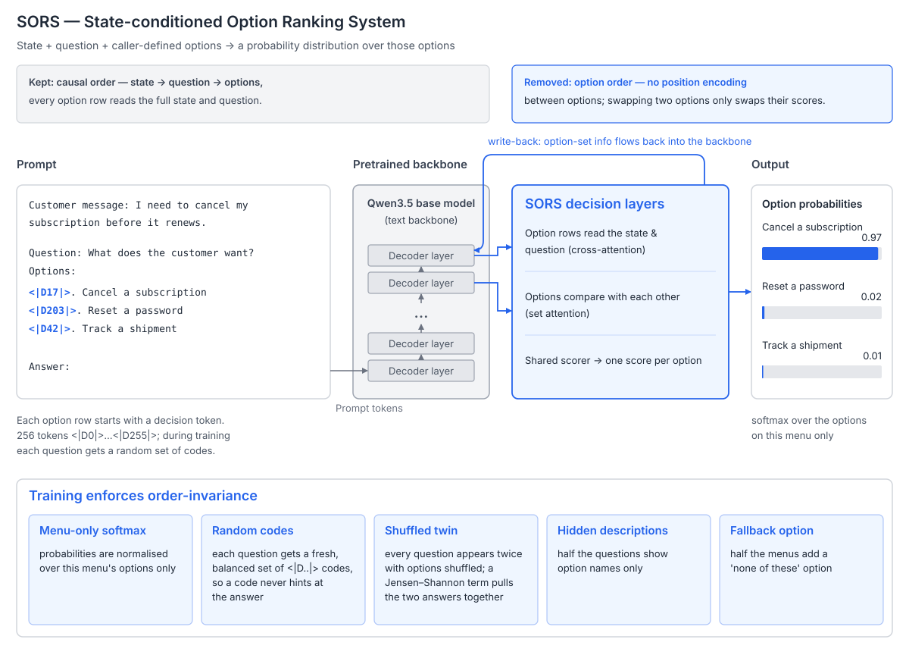

# SORS

**State-conditioned Option Ranking System**

[](LICENSE)

**English** | [简体中文](README.zh-CN.md)

Given a state, a set of questions and options defined by the caller, SORS returns a probability distribution over those options and nothing else.

**Model:** [🤗 SakuraYuyuko/Sors-2B](https://huggingface.co/SakuraYuyuko/Sors-2B)



SORS attaches a set of decision layers to the last layers of a Qwen3.5 backbone. Every option row on the menu starts with a decision token
(`<|D0|>` … `<|D255|>`, 256 in total), and the model's score for each option is read at that token. The tokens carry no meaning of their own:
during training each question gets a fresh, balanced set of codes, so any code that appears on a k-option menu is the answer with probability exactly 1/k,
and the model can only answer by reading the option text. The caller chooses the option names and how many there are, up to 255 per menu;
a new set of options needs no retraining.

The backbone is a causal language model, and SORS keeps the part of that order that helps: the state comes first, then the question, then the options,
so every option row reads the full state and question. What it removes is the order among the options. The decision layers have no position encoding
between options, so swapping two options only swaps their scores, and they write option-set information back into the backbone.
Training then applies the constraints shown at the bottom of the diagram to wear down any reliance on option order or codes.
The most direct one presents every question twice, in two random orders, and uses a Jensen–Shannon term to make the two answers agree.

## Benchmarks

Sors-2B is trained only on our own synthetic dataset, synth-intents-v5.3 (to be open-sourced once it is cleaned up);
none of the evaluation sets below take part in training. We wrote the synthetic data from scratch and it contains no content from existing datasets.
It deliberately stays out of Banking77's banking domain and MASSIVE's voice-assistant scenarios, and an automatic check blocks vocabulary from those domains.
We compared the training material (26,755 distinct texts) against every evaluation set below: no text is identical after normalisation;
no MASSIVE, BoolQ or JevBench item shares a run of 8 consecutive words with it; 4 of Banking77's 3,080 items share 8 words,
all of them everyday phrases such as "I don't want to be charged for".

| Benchmark | Questions | [Sors-2B](https://huggingface.co/SakuraYuyuko/Sors-2B) |
|---|---:|---:|
| Banking77 | 3,080 | 70.3 |
| Banking77 + descriptions | 3,080 | 81.1 |
| MASSIVE | 2,974 | 72.3 |
| MASSIVE + descriptions | 2,974 | 81.6 |
| BoolQ | 3,270 | 84.0 |
| Public JevBench easy | 48 | 100.0 |
| Public JevBench original | 72 | 90.3 |
| Public JevBench hard | 111 | 73.0 |
| Public JevBench overall | 231 | 84.0 |

Numbers are accuracy (%).

- **Banking77 and MASSIVE are answered against the full intent menu.** Every Banking77 question shows all 77 intents and every MASSIVE question shows all 60;
  no retriever or other model narrows them to a top-K shortlist first. "+ descriptions" adds a one-line description after each intent name.
- 17 of Banking77's intents never appear in training. The model meets them for the first time at evaluation.
- Option order: the same questions answered with their options shuffled into 5 random orders stay within 1.3 points of the table for Sors-2B,
  and the 5 orders pick the same option 0.86 of the time on Banking77, 0.82 on MASSIVE and 0.98 on BoolQ.
- Public JevBench is JevBench's public question set. Its tiers have only 48 / 72 / 111 questions, so differences of a few points there are noise; "overall" is accuracy over all 231 questions (194 correct). Results from the JevBench leaderboard will be added once available.

## Deployment

### Run directly

You need Python 3.13, [uv](https://docs.astral.sh/uv/) and a CUDA GPU.

```bash
uv sync
PYTHONPATH=src .venv/bin/python scripts/serve.py \
  --init SakuraYuyuko/Sors-2B --warmup --port 8000
```

When `--init` names a Hugging Face repository, the first start downloads the model into the standard HF cache (`~/.cache/huggingface`)
and later starts load it from there. Private repositories use the machine's `hf auth login` or `HF_TOKEN`. Add `--local-files-only`
to read only from the cache when offline; `--revision` selects a branch, tag or commit. `--init` also accepts a local model directory.
With `SORS_API_KEY` or `--api-key` set, requests need `Authorization: Bearer <key>`. `--demo` adds a playground page at `/demo/playground/`.

### Request

```bash
curl -s http://127.0.0.1:8000/v1/systemone \
  -H 'Content-Type: application/json' \
  -d '{
    "model": "Sors-2B",
    "state": "I need to cancel my subscription before it renews.",
    "questions": {
      "intent": {
        "type": "choice",
        "instructions": "What does the customer want?",
        "criteria": {
          "Cancel a subscription": null,
          "Reset a password": null,
          "Track a shipment": null
        }
      },
      "urgent": {
        "type": "noul",
        "instructions": "Does the customer need this done right away?"
      }
    }
  }'
```

`model` must match the served name. It defaults to the last part of the HF repository name or the model directory name, `Sors-2B` here,
and `--model-name` overrides it. One request can carry several questions that share the same `state`.

Response (probabilities are illustrative):

```json
{
  "model": "Sors-2B",
  "answers": {
    "intent": {
      "type": "choice",
      "choice": "Cancel a subscription",
      "probabilities": {"Cancel a subscription": 0.99, "Reset a password": 0.005, "Track a shipment": 0.005},
      "confidence": 0.985
    },
    "urgent": {"type": "noul", "noul": 0.71}
  },
  "usage": {"input_tokens": 118, "output_tokens": 2}
}
```

There are three question types. `choice` picks one of the caller's options (2–255, each with an optional description); `noul` is a yes/no question
and returns the probability of "yes"; `score` is an ordered scale (supported by the API, with no dedicated training data yet).
`state`, `instructions` and option descriptions can each be a string or JSON.

### Docker

The same model directory can be mounted into a container; see [docker/README.md](docker/README.md) for building and running it.

## License

Code is [MIT](LICENSE). Model weights follow Qwen's Apache-2.0. The API shape follows TypeSafe's
[System One](https://typesafe.ai/blog/introducing-system-one-models-and-jev); this project is not affiliated with TypeSafe AI.
